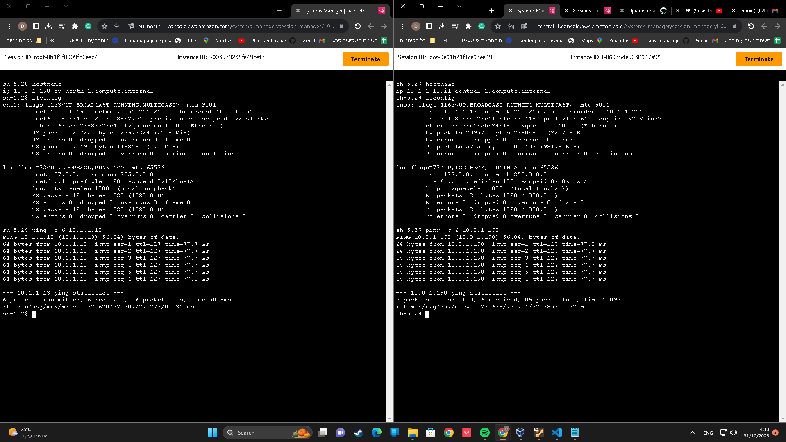
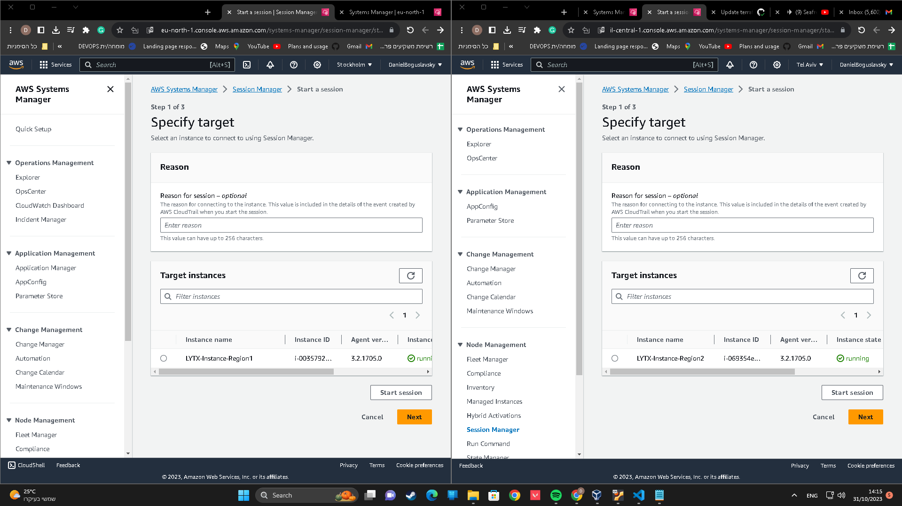
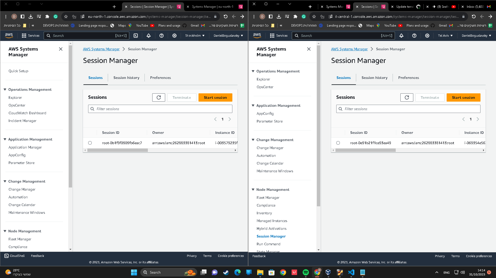

# AWS Infrastructure Setup with Terraform

## Introduction

This project outlines the steps and configurations required to set up a secure and efficient AWS environment using Terraform. The main goal is to create two EC2 instances located in different AWS regions, establish connectivity between them, and ensure secure access exclusively via AWS Systems Manager (SSM).

## Pre-requisites

Ensure your development environment is prepared, which can be either your local machine or a dedicated virtual machine running Linux.

### Required Tools

1. **AWS CLI**: Enables command-line interactions with AWS services. It is essential for Terraform to apply configurations.
2. **Terraform**: A tool for building, changing, and versioning infrastructure efficiently.
3. **Git**: For managing versions and interacting with the GitHub repository.
4. Additional tools as deemed necessary for the task.

## AWS Configuration

### Step 1: IAM Group and User Setup

1. **Create an IAM Group** named 'Administrators' or another relevant name.
   - Attach the following policies (consider creating custom policies for stricter security):
     - AmazonEC2FullAccess
     - AmazonS3FullAccess
     - AmazonSSMFullAccess
     - AmazonVPCFullAccess
     - IAMFullAccess (Optional)

2. **Create an IAM User**, add it to the 'Administrators' group, and generate an Access Key for this user.

### Step 2: Configure AWS CLI

Configure AWS CLI on your development environment using `aws configure`, providing the Access Key and Secret Key of the IAM user created previously.

## Terraform Setup

### Step 3: S3 Bucket for Terraform State

1. **Create a main project folder** and two subfolders.
2. **First Subfolder**: Contains Terraform scripts for creating an S3 bucket to store Terraform state files. Run `terraform apply` once in this folder to set up the bucket. This step is only needed for initial setup or creating a new environment.

### Step 4: Main Terraform Configuration

1. **Second Subfolder**: The primary folder containing various `.tf` files for different parts of the infrastructure.
2. **Apply Terraform**: With all configurations in place, run `terraform apply` to create and manage your AWS infrastructure.

## Proof of Work (Screenshots)

### EC2 Instances and Connectivity

*Ping test between EC2 instances demonstrating connectivity.*

### AWS SSM Connectivity

*Instances listed in SSM Session Manager.*

*Open SSM sessions, demonstrating accessibility.*

### CI/CD with GitHub Actions

*CI/CD pipeline running Terraform apply.*

---

**Note**: The Terraform setup is divided into two main parts. The first subfolder is used solely for the initial setup of the S3 bucket. After running `terraform apply` in that folder, all future interactions and infrastructure management should be conducted in the second subfolder containing the main Terraform configurations.
